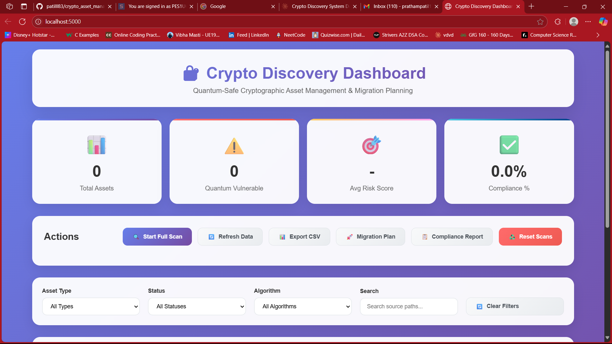

<h1 align="center">🔐 Crypto Discovery & Quantum Risk Dashboard</h1>

<p align="center">
<b>Discover, analyze, and manage cryptographic assets across your infrastructure.<br>
Modern dashboard for risk, compliance, and quantum migration planning.</b>
</p>

---

## 🚀 Overview

Crypto Discovery is a modular Python system for scanning, inventorying, and managing cryptographic assets (certificates, SSH keys, code references) across your environment. It provides:

- **Automated asset discovery** (certs, SSH keys, code)
- **Risk scoring** (quantum vulnerability, deprecated/weak crypto)
- **Compliance analytics** (NIST PQC, deprecated usage)
- **Migration planning** (quantum-safe recommendations)
- **Modern web dashboard** for visualization and management

---

## 🖼️ Project Showcase

<p align="center">
  
  <br><i>Main dashboard: asset summary, risk, compliance, and migration plan at a glance.</i>
</p>

<p align="center">
  
  <br><i>Detailed asset inventory with risk and quantum vulnerability indicators.</i>
</p>

<p align="center">
  
  <br><i>Automated migration plan for quantum-safe upgrades.</i>
</p>

> **Tip:** Replace these images with your own screenshots from the running dashboard for best results!

---

## 🧩 Features

- **Full cryptographic asset discovery**: Scans certificates, SSH keys, and code repositories for crypto usage.
- **Risk scoring**: Assesses each asset for quantum vulnerability, deprecated/weak algorithms, and urgency.
- **Compliance analytics**: NIST PQC readiness, deprecated usage, and actionable recommendations.
- **Migration planning**: Generates prioritized, actionable plans for quantum-safe upgrades.
- **Modern dashboard**: Interactive web UI (Flask + HTML/JS/CSS) for asset management, risk, compliance, and export.
- **API-first**: REST endpoints for integration and automation.
- **Export**: Download asset inventory as CSV.
- **Reset**: One-click reset of all scans/assets for fresh analysis.

---

## 📊 Dashboard Preview

> _The dashboard provides real-time visibility into your cryptographic landscape:_

- Asset summary (by type, status, algorithm)
- Risk distribution (low/medium/high)
- Compliance percentage and issues
- Migration plan with priorities and timelines
- Asset table with search, filter, and export

---

## 🛠️ Quickstart

### 1. Install requirements

```bash
pip install -r requirements.txt
```

### 2. Run the dashboard

```bash
python crypto_discovery.py --web
```

Then open [http://localhost:5000](http://localhost:5000) in your browser.

### 3. Run a scan

Click **"Run Scan"** in the dashboard, or use:

```bash
python crypto_discovery.py --scan
```

---

## 🧑‍💻 API Endpoints

| Endpoint                | Method | Description                                 |
|------------------------|--------|---------------------------------------------|
| `/api/scan`            | POST   | Start a new cryptographic scan              |
| `/api/scan/status`     | GET    | Get current scan status                     |
| `/api/assets`          | GET    | List all discovered assets                  |
| `/api/assets/summary`  | GET    | Asset summary and risk distribution         |
| `/api/migration/plan`  | GET    | Quantum-safe migration plan                 |
| `/api/compliance/report`| GET   | Compliance analytics report                 |
| `/api/export/csv`      | GET    | Export asset inventory as CSV               |
| `/api/reset`           | POST   | Reset all scans and assets                  |

---

## 📁 Project Structure

```text
crypto_discovery.py      # Main backend (Flask API, scan logic)
dashboard.html           # Frontend dashboard (HTML)
style.css                # Dashboard styles
app.js                   # Dashboard JS/API logic
crypto_discovery.db      # SQLite database (auto-created)
crypto_discovery.log     # Log file
src/                     # (Optional) Source code to scan
certs/                   # (Optional) Certificates to scan
ssh_keys/                # (Optional) SSH keys to scan
docs/images/             # Screenshots for showcase
README.md                # This file
```

---

## 📚 Documentation

- **Risk scoring**: Each asset is scored based on algorithm, key size, and quantum vulnerability. See code for details.
- **Compliance**: NIST PQC readiness, deprecated usage, and recommendations are calculated automatically.
- **Migration plan**: Prioritized by risk and asset type, with effort and timeline estimates.
- **Scheduler**: Daily automated scans (can be customized in code).

---

## 🤝 Contributing

Contributions, issues, and feature requests are welcome! Please open an issue or PR.

---

## 📝 License

MIT License. See [LICENSE](LICENSE) for details.

---

## 🙏 Acknowledgements

- [cryptography](https://cryptography.io/), [Flask](https://flask.palletsprojects.com/), [schedule](https://schedule.readthedocs.io/)
- NIST PQC, OpenSSF, and the open source security community

---

<p align="center">
<b>Showcase your quantum-safe journey!<br>
Add your screenshots to <code>docs/images/</code> and update this README for a stunning GitHub presentation.</b>
</p>